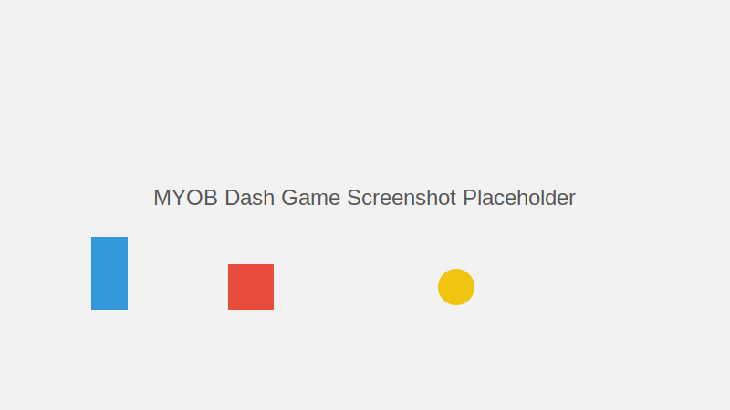

# 🚀 MYOB Dash

## 🎯 Demo

You can play MYOB Dash right in your browser at [juliancodespotimyob.github.io/myob-dash/](https://juliancodespotimyob.github.io/myob-dash/)



> An exhilarating endless runner where you navigate the perils of tax obstacles while collecting coins in the MYOB universe!

[](https://phaser.io/)
[](https://developer.mozilla.org/en-US/docs/Web/JavaScript)
[](https://opensource.org/licenses/MIT)

## 📖 Table of Contents

- [Overview](#-overview)
- [Features](#-features)
- [Demo](#-demo)
- [Getting Started](#-getting-started)
- [How to Play](#-how-to-play)
- [Game Mechanics](#-game-mechanics)
- [Development](#-development)
- [Contributing](#-contributing)
- [License](#-license)

## 🎮 Overview

**MYOB Dash** is an action-packed endless runner game where you take control of a business-savvy hero navigating through a world of tax obstacles. Jump, double-jump, and strategically descend to avoid tax collectors and flying drones while collecting coins to boost your score. With increasing difficulty, combo multipliers, and special power-ups, every run presents a unique challenge!

## ✨ Features

### Core Gameplay
- **Endless Runner** - Run as far as you can while avoiding obstacles
- **Progressive Difficulty** - Game speed and obstacle frequency increase over time
- **Responsive Controls** - Simple, tight controls with jump buffering and coyote time

### Advanced Mechanics
- **Combo System** - Chain coin collections for multipliers (up to 4x)
- **Power-ups** - Collect coins to unlock:
  - 🛡️ **Shield** - Protects from one hit
  - ⚡ **Speed Boost** - Temporarily increases movement speed

### Visual Polish
- **Particle Effects** - Visual feedback for jumps, coins, and power-ups
- **Screen Effects** - Camera shake, flashes, and time dilation at key moments
- **Animation Juicing** - Squash and stretch animations for jumps and landings

### Technical Features
- **Adaptive Asset Loading** - Gracefully handles missing assets with fallbacks
- **Responsive Design** - Scales to fit different screen sizes
- **Performance Optimized** - Object pooling for game entities

## 🚀 Getting Started

### Prerequisites

- A modern web browser
- Local web server (for development)

### Installation

1. Clone the repository:
   ```bash
   git clone https://github.com/yourusername/myob-dash.git
   cd myob-dash
   ```

2. Set up a local web server:
   
   Using Python:
   ```bash
   # Python 3.x
   python -m http.server
   
   # Python 2.x
   python -m SimpleHTTPServer
   ```
   
   Or with Node.js:
   ```bash
   # Install http-server globally if needed
   npm install -g http-server
   
   # Run server
   http-server
   ```

3. Open your browser and navigate to:
   ```
   http://localhost:8000
   ```

### Assets Structure

Ensure your assets directory has the following structure:
```
assets/
├── player_sheet.png      # Player animation spritesheet
├── enemy.png             # Ground enemy (tax collector)
├── tax_drone.png         # Flying enemy (tax drone)
├── coin.png              # Collectible coin
├── background.png        # Game background
├── logo.png              # MYOB Dash logo
├── particle.png          # Particle effect texture
└── sounds/
    ├── jump.mp3          # Jump sound effect
    ├── coin.mp3          # Coin collection sound
    ├── hit.mp3           # Collision sound
    └── music.mp3         # Background music
```

## 🎲 How to Play

### Controls

| Action | Keyboard | Touch |
|--------|----------|-------|
| Jump | SPACE / UP arrow | Tap screen |
| Double Jump | Press SPACE / UP while in air | Tap screen while in air |
| Fast Fall | DOWN arrow | Swipe down (not implemented yet) |

### Objective

- Run as far as possible without hitting obstacles
- Collect coins to increase your score
- Chain coin collections to earn multipliers
- Build up your coin total to trigger power-ups
- Beat your high score!

## 🔧 Game Mechanics

### Scoring System

- **Base Points**: 10 points per coin
- **Combo Multipliers**:
  - 3-4 consecutive coins: 2x multiplier
  - 5-7 consecutive coins: 3x multiplier
  - 8+ consecutive coins: 4x multiplier

### Power-ups

Power-ups are triggered automatically after collecting 20 coins:

| Power-up | Effect | Duration |
|----------|--------|----------|
| **Speed Boost** | Increases movement speed by 60% | 10 seconds |
| **Shield** | Protects from a single hit | Until hit |

### Obstacles

- **Tax Collectors** - Ground-based obstacles you must jump over
- **Tax Drones** - Flying obstacles at variable heights
- **Gaps/Pits** - Sections of missing platform you must jump across

## 💻 Development

### Project Structure

```
myob-dash/
├── assets/            # Game assets (images, sounds)
├── src/               # Source code
│   ├── game.js        # Main game logic
│   └── index.html     # HTML entry point
└── README.md          # This documentation
```

### Technologies Used

- **[Phaser 3](https://phaser.io/)** - HTML5 Game Framework
- **JavaScript** - Core programming language
- **HTML5 Canvas** - Rendering

### Key Components

- `GameScene` - The main game scene containing all game logic
- Asset management system with fallbacks for missing assets
- Collision detection and physics systems
- Particle effects and visual feedback systems

## 🤝 Contributing

Contributions are welcome! Here's how you can help:

1. Fork the repository
2. Create a feature branch: `git checkout -b feature/amazing-feature`
3. Commit your changes: `git commit -m 'Add some amazing feature'`
4. Push to the branch: `git push origin feature/amazing-feature`
5. Open a Pull Request

### Development Guidelines

- Follow the existing code style and organization
- Add comments for new functions and complex logic
- Test thoroughly across different browsers
- Update documentation for significant changes

## 📄 License

This project is licensed under the MIT License - see the LICENSE file for details.

---

<p align="center">
  Made with ❤️ for MYOB by the Dash Team
</p>
